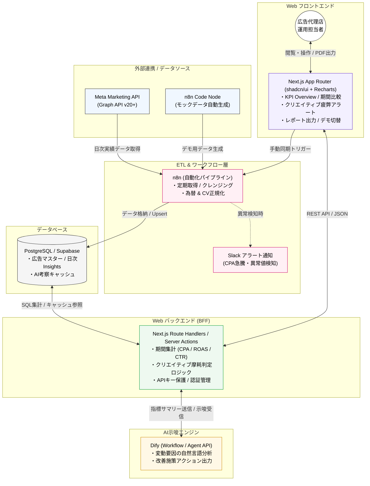

# システム要件定義書

**プロジェクト名:** InsightOps (Meta広告運用モニタリング & AI示唆ダッシュボード)  
**対象領域:** 運用型広告・Meta Marketing API・n8n・Dify連携・Next.js / PostgreSQL

---

## 1. プロジェクト概要・背景・目的

本システム「InsightOps」は、Meta（Facebook/Instagram）広告の運用を担当する広告代理店担当者を対象とした運用ダッシュボードアプリケーションである。  
日々のメトリクス確認工数の削減、クリエイティブ摩耗（疲弊）の早期検知、およびAIを活用した分析・レポート下書き作成の自動化を実現する。  
また、外部ツール（n8nによるETL/定期同期、DifyによるLLM示唆生成）と疎結合に連携し、実運用とポートフォリオデモの両立を図る。

---

## 2. ターゲットユーザー（ペルソナ）と提供価値

| 項目 | 詳細定義 |
| :--- | :--- |
| **ターゲットペルソナ** | 広告代理店で複数クライアントのMeta広告運用を担当する広告運用者・コンサルタント |
| **現状の課題** | 1. 毎朝管理画面を開いて数値集計・差分確認を行う工数負荷が大きい。 2. バナー/動画のフリークエンシー上昇・CTR低下による「摩耗」の発見が遅れ、CPAが悪化する。 3. クライアント向けの要因分析や施策提案レポートの作成に時間がかかる。 |
| **提供価値（解決策）** | 1. **朝イチ確認1分化:** 主要KPI（Spend, CPA, ROAS, CTR, CVR）と前期間比を一覧化。 2. **摩耗アラート:** 接触頻度とCTR低下率から差し替え推奨クリエイティブを自動ハイライト。 3. **AI示唆 & 自動レポート:** Dify連携により、変動要因の自然言語解説と施策案を即時出力。 |

---

## 3. システムアーキテクチャ & 技術スタック

## 4. 機能要件一覧

| 機能ID | 機能名 | 優先度 | 機能詳細・要件仕様 |
| :--- | :--- | :---: | :--- |
| **F-01** | KPI Overview | MUST | 消化金額、CPA、ROAS、CTR、CVRの推移グラフと当期累計値、前期間（前週/前月）比差分を表示。 |
| **F-02** | 期間・粒度フィルタ | MUST | 直近7日、直近30日、今月、カスタム範囲の選択。日次・週次集計の切り替え。 |
| **F-03** | クリエイティブ疲弊検知 | MUST | 広告ごとの累計フリークエンシーとCTR推移を算出し、閾値超過時に「要差し替え」警告バッジを表示。 |
| **F-04** | 階層ドリルダウン分析 | SHOULD | Campaign → AdSet → Ad の3階層でのテーブル展開およびプレースメント別（Reels/Feed等）の内訳表示。 |
| **F-05** | Dify連携 AI考察生成 | MUST | 期間サマリーをDify Workflow APIに送信し、変動要因の考察と改善アクション提案をMarkdown形式で取得・表示。 |
| **F-06** | レポート出力 | SHOULD | 画面上のKPIサマリー、主要グラフ、AI考察文を統合したクライアント共有用PDF/Markdownエクスポート。 |
| **F-07** | n8nデータ同期トリガー | SHOULD | 「今すぐ同期」ボタンによりn8nのWebhookを実行し、最新データの取得処理をキック。 |
| **F-08** | モックデータ切替機能 | MUST | Meta認証なしでもポートフォリオ閲覧者が全機能を体験できるデモデータ表示モードの搭載。 |

---

## 5. データベース設計（主要テーブル定義）

| テーブル名 | 主要カラム | 概要・用途 |
| :--- | :--- | :--- |
| **ad_accounts** | `id`, `name`, `currency`, `timezone`, `is_mock` | 広告アカウントマスター |
| **campaigns** | `id`, `account_id`, `name`, `objective`, `status` | キャンペーンマスター |
| **ad_sets** | `id`, `campaign_id`, `name`, `targeting`, `bid_strategy` | 広告セット（ターゲティング情報等） |
| **ad_creatives** | `id`, `ad_set_id`, `name`, `format_type`, `image_url`, `body_text` | 広告クリエイティブマスター |
| **daily_insights** | `id`, `date`, `ad_creative_id`, `spend`, `impressions`, `clicks`, `conversions`, `conversion_value`, `frequency` | 日次運用実績メトリクス（Meta API準拠・集計ベース） |
| **ai_insights_cache** | `id`, `account_id`, `date_range`, `input_metrics_hash`, `analysis_result_md`, `created_at` | Difyが生成したAI考察のキャッシュ管理 |

---

## 6. 外部インターフェース & 処理分担

| 連携先 / レイヤー | 通信プロトコル / 方式 | 担当処理・データフロー |
| :--- | :--- | :--- |
| **Meta Marketing API / Mock** | HTTPS GET (Graph API v20+) / n8n Code Node | 日次インサイト（spend, impressions, clicks, actions）の取得およびモックデータのシード生成。 |
| **n8n (ETL)** | Cron定期実行 / Webhook POST | APIデータ取得、為替・CV定義の正規化、DBへのUpsert保存、異常値検知時のSlack通知。 |
| **Dify API** | HTTPS POST (Workflow API) | 集計データ（前週比・摩耗広告一覧）を入力として渡し、LLMによる要因分析・改善施策JSON/Markdownを受信。 |
| **Next.js Backend (BFF)** | Route Handlers / Server Actions | DB集計クエリ実行、摩耗判定ロジック計算、Dify/n8n通信中継、APIキーのセキュア保護。 |
| **Next.js Frontend** | React, Recharts, Tailwind CSS | ダッシュボード描画、フィルタリング操作、同期/AI再分析の実行トリガー、PDF出力。 |

---

## 7. 非機能要件 & ポートフォリオアピール項目

* **セキュリティ:** Meta Access Token、Dify API Keyなどの秘匿情報は環境変数（`.env`）で管理し、クライアント側へ一切露出させないBFF構成とする。
* **パフォーマンス:** 頻繁に参照される期間集計結果およびDifyのAI考察結果をDB/キャッシュに保持し、画面表示速度2秒以内を担保。
* **ポートフォリオ評価ポイント:**
  * 実務に即したMeta Marketing APIデータ構造（Insights階層）に完全準拠したスキーマ設計。
  * 単なるCRUDではなく、ローコード（n8n/Dify）とフルスタック（Next.js/PostgreSQL）を適材適所で組み合わせた実務的なシステムアーキテクチャ。
  * 選考官が手軽に検証できるシームレスな「モックデータ（デモモード）」の提供。